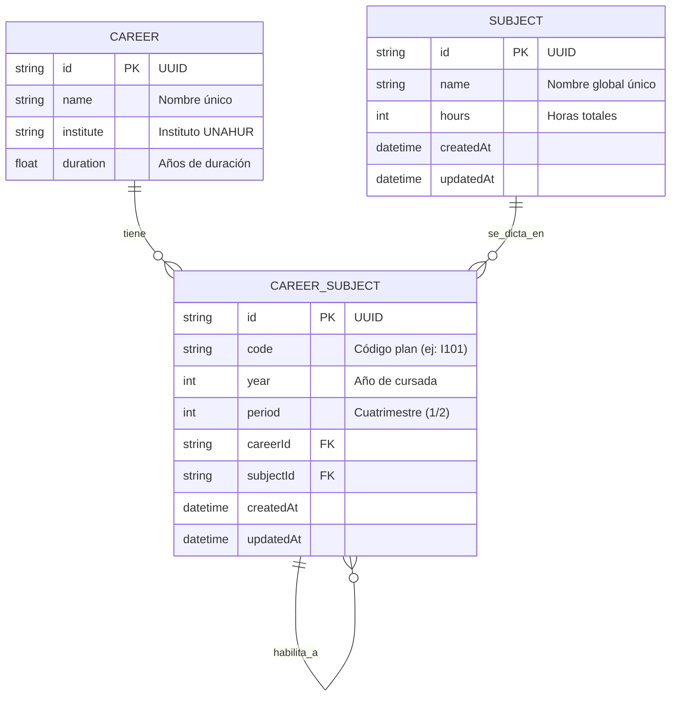

# Documentación de la Base de Datos (CursApp)

Esquema actual de la base de datos PostgreSQL gestionado con Prisma ORM.

## Diagrama de Entidades (ERD)



---

## Modelos Implementados

### 1. `Career` (Carreras)

Catálogo de carreras de la UNAHUR.

| Campo | Tipo | Descripción | Constraints |
|-------|------|-------------|-------------|
| `id` | String (UUID) | Identificador único | PK, autogenerado |
| `name` | String | Nombre de la carrera | Unique, obligatorio |
| `institute` | String? | Instituto al que pertenece | Opcional (ej: "Tecnología e Ingeniería") |
| `duration` | Float? | Duración en años | Opcional (ej: 5.0) |
| `subjects` | CareerSubject[] | Materias vinculadas | Relación 1:N |

**Ejemplo:**
```json
{
  "id": "uuid-123",
  "name": "Licenciatura en Informática",
  "institute": "Tecnología e Ingeniería",
  "duration": 5.0
}
```

---

### 2. `Subject` (Materias Globales)

Diccionario maestro de materias. Una materia puede existir en múltiples carreras.

| Campo | Tipo | Descripción | Constraints |
|-------|------|-------------|-------------|
| `id` | String (UUID) | Identificador único | PK, autogenerado |
| `name` | String | Nombre de la materia | Unique, obligatorio |
| `hours` | Int | Horas totales de cursada | Default: 0 |
| `careers` | CareerSubject[] | Carreras donde se dicta | Relación 1:N |
| `createdAt` | DateTime | Fecha de creación | Autogenerado |
| `updatedAt` | DateTime | Fecha de modificación | Auto-actualizado |

**Ejemplo:**
```json
{
  "id": "uuid-456",
  "name": "Matemática I",
  "hours": 64
}
```

---

### 3. `CareerSubject` (Materias por Plan de Estudios)

Tabla intermedia que contextualiza una materia global dentro de una carrera específica. Aquí se definen códigos, años, períodos y correlatividades.

| Campo | Tipo | Descripción | Constraints |
|-------|------|-------------|-------------|
| `id` | String (UUID) | Identificador único | PK, autogenerado |
| `code` | String | Código en el plan (ej: "I101") | Obligatorio |
| `year` | Int? | Año de cursada en esta carrera | Opcional |
| `period` | Int? | Cuatrimestre (1 o 2) | Opcional |
| `careerId` | String | ID de la carrera | FK → Career.id |
| `subjectId` | String | ID de la materia global | FK → Subject.id |
| `prerequisites` | CareerSubject[] | Correlativas que requiere | Relación M:N (self-ref) |
| `requiredBy` | CareerSubject[] | Materias que la requieren | Relación M:N (self-ref) |
| `createdAt` | DateTime | Fecha de creación | Autogenerado |
| `updatedAt` | DateTime | Fecha de modificación | Auto-actualizado |

**Constraints Únicos:**
- `@@unique([careerId, subjectId])`: Una materia global no puede aparecer dos veces en la misma carrera.

**Ejemplo:**
```json
{
  "id": "uuid-789",
  "code": "I101",
  "year": 1,
  "period": 1,
  "careerId": "uuid-123",
  "subjectId": "uuid-456",
  "prerequisites": []
}
```

---

## Relaciones Clave

### Correlatividades
Las correlatividades se modelan como una relación M:N de `CareerSubject` consigo misma:

```prisma
prerequisites CareerSubject[] @relation("CareerSubjectCorrelatives")
requiredBy    CareerSubject[] @relation("CareerSubjectCorrelatives")
```

- `prerequisites`: Materias que DEBE tener aprobadas/regularizadas para cursar esta.
- `requiredBy`: Materias que se desbloquean al aprobar esta.

**Ejemplo:**
- "Matemática II" tiene como `prerequisite` a "Matemática I"
- "Matemática I" tiene en `requiredBy` a "Matemática II"

---

## Datos de Seed

El sistema incluye:
- **46 carreras UNAHUR** organizadas por instituto
- **~406 materias** distribuidas en 15 planes de estudio JSON
- **Correlatividades** definidas en los planes JSON

### Carreras por Instituto

| Instituto | Cantidad |
|-----------|----------|
| Biotecnología | 10 |
| Tecnología e Ingeniería | 20 |
| Salud Comunitaria | 8 |
| Educación | 8 |

### Archivos de Planes JSON

Ubicados en `backend/prisma/careers/`:
- `lic-informatica.json` (59 materias)
- `lic-tecnologia-alimentos.json` (57 materias)
- `prof-letras.json` (57 materias)
- `ing-energia-electrica.json` (46 materias)
- `tec-mantenimiento-hospitalario.json` (28 materias)
- Y 10 más...

---

## Flujo de Importación

1. **Seed de Carreras**: Se crean las 46 carreras UNAHUR (`prisma/seed.ts`)
2. **Importación de Planes**: `CareersImportService` lee los JSON y:
   - Crea las materias globales (`Subject`) si no existen
   - Crea los vínculos carrera-materia (`CareerSubject`)
   - Establece las correlatividades entre `CareerSubject`

---

## Índices y Optimización

- PK automáticos en todos los modelos (UUID v4)
- Índice único en `Career.name`
- Índice único en `Subject.name`
- Índice único compuesto en `CareerSubject[careerId, subjectId]`
- Timestamps automáticos (`createdAt`, `updatedAt`)

---

## Notas de Diseño

### ¿Por qué separar `Subject` de `CareerSubject`?

1. **Reutilización**: "Matemática I" puede existir en múltiples carreras con el mismo ID global
2. **Equivalencias**: Facilita detectar equivalencias entre carreras
3. **Normalización**: La carga horaria es propiedad de la materia, no de la relación carrera-materia
4. **Flexibilidad**: Código, año y período son propiedades contextuales a cada carrera

### ¿Por qué self-relation en `CareerSubject`?

Las correlatividades existen DENTRO del contexto de una carrera específica. "Matemática II" requiere "Matemática I" solo en el contexto de Informática, no necesariamente en Biotecnología.