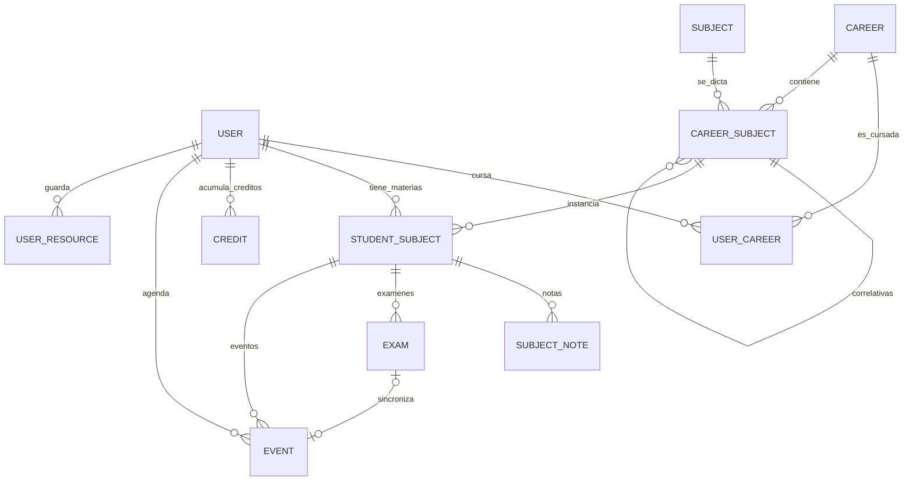

# Documentación de la Base de Datos (CursApp v2.0)

Esquema completo de PostgreSQL para sistema de seguimiento académico profesional.

---

## 📊 Diagrama Entidad-Relación

## 🗂️ Tablas Principales

### 1. Catálogo: Career, Subject, CareerSubject

#### Career
| Campo | Tipo | Descripción |
|-------|------|-------------|
| id | UUID | PK |
| name | String | Nombre único de carrera |
| institute | String? | Instituto UNAHUR |
| duration | Float? | Años de duración |

#### Subject
| Campo | Tipo | Descripción |
|-------|------|-------------|
| id | UUID | PK |
| name | String | Nombre único de materia |
| hours | Int | Horas totales |

#### CareerSubject
Materia específica de un plan de estudios con código, año y período.

| Campo | Tipo | Descripción |
|-------|------|-------------|
| id | UUID | PK |
| code | String | Código plan (I101) |
| year | Int? | Año de cursada |
| period | Int? | Cuatrimestre (1/2) |
| careerId | UUID | FK → Career |
| subjectId | UUID | FK → Subject |
| prerequisites | CareerSubject[] | Correlativas requeridas |
| requiredBy | CareerSubject[] | Materias que habilita |

### 2. Usuarios: User, UserCareer

#### User
| Campo | Tipo | Descripción |
|-------|------|-------------|
| id | UUID | PK |
| email | String | Email único |
| name | String | Nombre completo |
| password | String | Hash bcrypt |

#### UserCareer
Permite cursar **2 carreras** simultáneamente.

| Campo | Tipo | Descripción |
|-------|------|-------------|
| id | UUID | PK |
| userId | UUID | FK → User |
| careerId | UUID | FK → Career |
| approvedCount | Int | Materias aprobadas |
| isActive | Boolean | Carrera activa |

**Constraint:** `@@unique([userId, careerId])`

### 3. Materias del Estudiante

#### Enum SubjectStatus
- `PENDIENTE` - No iniciada
- `EN_CURSO` - Cursando actualmente
- `REGULARIZADA` - Aprobada cursada, pendiente final
- `PROMOCIONADA` - Aprobada definitivamente
- `DESAPROBADA` - No aprobada
- `RECURSANDO` - Reintentando

#### StudentSubject
Instancia de materia por usuario.

| Campo | Tipo | Descripción |
|-------|------|-------------|
| id | UUID | PK |
| userId | UUID | FK → User |
| careerSubjectId | UUID | FK → CareerSubject |
| status | SubjectStatus | Estado actual |
| courseGrade | Float? | Nota de cursada |
| finalGrade | Float? | Nota final |
| attemptCount | Int | Intentos (default: 1) |

#### SubjectNote
Notas y links por materia (US-04).

| Campo | Tipo | Descripción |
|-------|------|-------------|
| id | UUID | PK |
| studentSubjectId | UUID | FK |
| title | String? | Título |
| content | String? | Contenido |
| url | String? | Link |

#### Exam
Parciales, recuperatorios, finales.

| Campo | Tipo | Descripción |
|-------|------|-------------|
| id | UUID | PK |
| studentSubjectId | UUID | FK |
| type | String | Tipo: parcial1, parcial2, final, etc |
| date | DateTime? | Fecha del examen (Opcional) |
| grade | Float? | Nota obtenida |
| maxGrade | Float | Nota máxima (default: 10) |
| eventId | UUID? | FK (Unique) → Event (Sync Calendario) |

### 4. Créditos Extracurriculares

#### Credit (US-05)
| Campo | Tipo | Descripción |
|-------|------|-------------|
| id | UUID | PK |
| userId | UUID | FK → User |
| category | String | Categoría (Cursos, Seminarios) |
| activity | String | Descripción actividad |
| credits | Int | Cantidad de créditos |
| date | DateTime | Fecha realización |

### 5. Calendario

#### Event
| Campo | Tipo | Descripción |
|-------|------|-------------|
| id | UUID | PK |
| userId | UUID | FK → User |
| studentSubjectId | UUID? | FK (opcional) |
| title | String | Título evento |
| type | String | parcial, final, entrega, general |
| date | DateTime | Fecha |
| description | String? | Descripción |
| examRecord | Exam? | Relación inversa con Exam |

### 6. Recursos

#### GlobalResource
Recursos default para todos los usuarios.

| Campo | Tipo | Descripción |
|-------|------|-------------|
| id | UUID | PK |
| category | String | unahur, calendario, biblioteca |
| title | String | Título |
| url | String | URL |
| isDefault | Boolean | Visible para todos |

#### UserResource
Recursos personales del usuario.

| Campo | Tipo | Descripción |
|-------|------|-------------|
| id | UUID | PK |
| userId | UUID | FK → User |
| category | String | Categoría personal |
| title | String | Título |
| url | String? | URL opcional |

## 🔑 Constraints Únicos

- `User.email`
- `Career.name`
- `Subject.name`
- `CareerSubject[careerId, subjectId]`
- `CareerSubject[careerId, code]`
- `UserCareer[userId, careerId]`
- `StudentSubject[userId, careerSubjectId]`

## 🎯 Cobertura BRD

- US-01 Dashboard: Métricas desde StudentSubject, Credit
- US-02 Estados: Transiciones en StudentSubject.status
- US-03 Recomendaciones: Query sobre CareerSubject.prerequisites
- US-04 Notas: SubjectNote
- US-05 Créditos: Credit
- US-06 Graduación: Cálculos sobre StudentSubject
- US-07 Setup: User + UserCareer + StudentSubject masivo
- US-08 Simulador: Cálculos temporales
- US-09 Recursadas: attemptCount
- RN1-RN9: Todas las reglas soportadas por el schema
- 2 Carreras: UserCareer con approvedCount
- Calendario: Event (generales y por materia)
- Recursos: GlobalResource + UserResource
